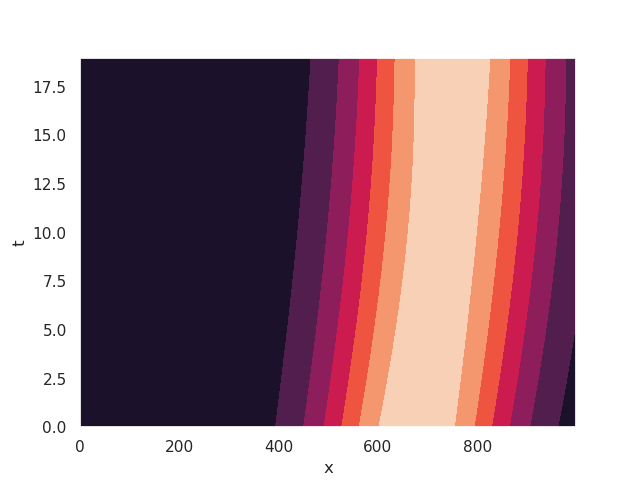
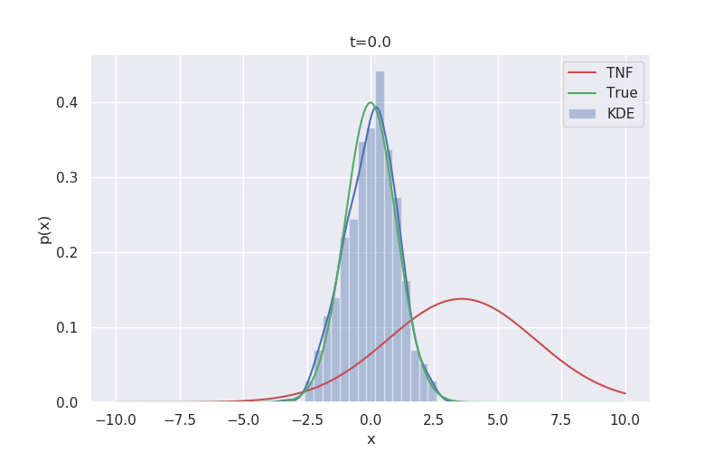
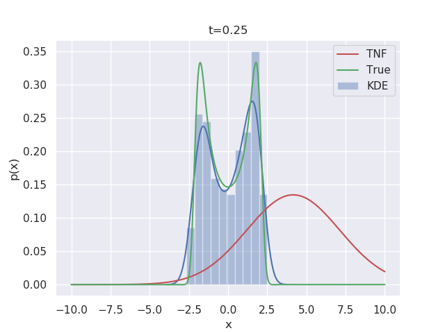
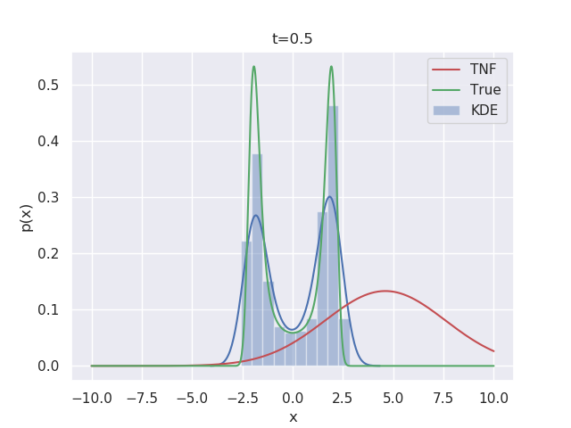
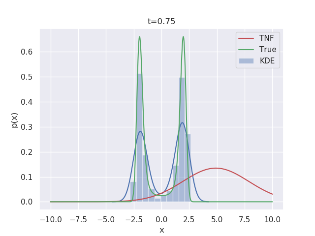

# Temporal-normalizing-flows-for-SDEs
## Romit's branch

Example 1  
We consider a 1-D double-well system with Brownian motion  
dX_t = f(X_t)dt + dB_t, where f(x)=4x-x^3.  
See TNFforDWwithBM.py  

I used the RealNVP layer with the `s` and `t` neural networks as a function of time only and without any permutation (because time always has to be first dimension). This obviously did not work very well - but for higher dimensional systems we may have permutations like [t, x, y, z] -> [t, y, z, x] -> [t, z, x, y] etc etc. Those might help with better distribution approximation.

Some examples:

